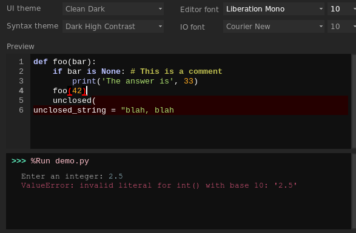

# thonny-syntax-dark-high-contrast-flinti
Thonny dark theme that provides higher contrast between the code and the background than the 'Default Dark *' themes.

## Installation
Install Thonny, then use a shell:
    git clone https://github.com/flinti/thonny-syntax-dark-high-contrast
    pip install thonny-syntax-dark-high-contrast/
Open Thonny, goto `Tools -> Theme & Font` and select `Dark High Contrast` from the `Syntax theme` dropdown menu.
## Uninstallation
    pip uninstall thonny-syntax-dark-high-contrast-flinti

